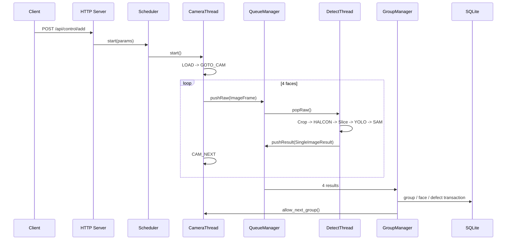

# Cylinder Detection

基于 **C++20 / OpenCV CUDA / TensorRT / HALCON / SAM / SQLite / libevent** 的工业圆柱表面缺陷检测服务。项目面向多面相机采集场景：滑台完成上料与转面，相机依次采集四个表面，GPU 检测线程执行预处理、中心定位、切片检测与分割测量，最终按组汇总 GOOD / NG 并写入 SQLite。

> 当前工程主要面向 Windows + NVIDIA GPU + Visual Studio 2022。相机 SDK、HALCON、TensorRT 与第三方库需要在本机正确安装/配置。

## 架构

```mermaid
flowchart LR
    Client[上位机 / HTTP Client]
    Config[config.json]
    Server[HTTP Server\nlibevent]
    State[ServerState]
    Scheduler[Scheduler]
    Camera[CameraThread\nMPHdc Camera SDK]
    Slide[SlideSerialClient\nUART Slide]
    RawQ[(Raw Queue)]
    Workers[DetectThread x N]
    Crop[CUDA Crop / Stripe Removal]
    Halcon[HALCON Center Extraction]
    Slice[GPU Slice]
    YOLO[TensorRT YOLO]
    SAM[SAM Segmentation]
    ResultQ[(Result Queue)]
    Group[GroupManager]
    DB[(SQLite)]
    Output[(Output Files)]
    Single[SingleDetectThread]

    Config --> Server
    Config --> Scheduler
    Client -->|REST API| Server
    Server --> State
    State --> Scheduler

    Scheduler --> Camera
    Camera <--> Slide
    Camera --> RawQ
    RawQ --> Workers
    Workers --> Crop --> Halcon --> Slice --> YOLO --> SAM
    SAM --> ResultQ
    ResultQ --> Group
    Group --> DB
    Group -->|allow_next_group| Camera
    Workers --> Output

    Server -->|single image API| Single
    Single --> Crop
    Single --> Output
```



### 多面检测主链路



## 目录结构

```text
.
├── main.cpp                  # 入口：CLI、配置、数据库、run_id、HTTP Server
├── config.json               # 运行时配置
├── Core/
│   ├── Config.*              # 配置加载与路径解析
│   ├── Server.*              # HTTP API 与服务状态
│   ├── Scheduler.*           # 多线程生命周期编排
│   ├── camera_thread.*       # 相机采集 + 滑台流程
│   ├── detect_thread.*       # 多面检测 GPU worker
│   ├── single_detect_thread.*# 单图检测 worker
│   ├── group_manager.*       # 四面结果聚合
│   ├── queue_manager.*       # 原始帧 / 结果并发队列
│   ├── db_utils.*            # SQLite schema / run 注册
│   ├── sqlite_helper.hpp     # SQLite RAII 辅助层
│   ├── slide_serial.*        # UART 滑台通信
│   ├── image_types.hpp       # 公共数据结构
│   └── detect/               # CUDA / TensorRT / HALCON / SAM 算法实现
├── docs/
│   ├── api.md
│   ├── architecture.md
│   ├── CODE_AUDIT.md         # 当前代码审计与后续重构优先级
│   └── ...
├── pytesttool/               # API 调试脚本
├── mt.sln
└── mt.vcxproj
```

## 配置

所有相对路径都以 **配置文件所在目录** 为基准解析，因此不需要把某台开发机的 `E:\...` / `D:\...` 写进运行时配置。

```json
{
  "host": "127.0.0.1",
  "analyzerPort": 9003,
  "modelDir": "./models",
  "uploadDir": "./output",
  "dbPath": "./data/my_inspection.db",
  "gpuDevice": 0,
  "detectThreads": 4,
  "groupTimeoutMs": 55000,
  "slidePort": "",
  "slideAxisId": 0,
  "slideTimeoutMs": 20000
}
```

关键项：

| 配置 | 作用 |
| --- | --- |
| `host` / `analyzerPort` | HTTP 监听地址与端口 |
| `modelDir` | TensorRT / SAM 模型根目录 |
| `uploadDir` | 图片与可视化结果目录 |
| `dbPath` | SQLite 数据库路径 |
| `gpuDevice` | 目标 CUDA device，后续算法层需要完全统一使用 |
| `detectThreads` | 多面检测 worker 数 |
| `groupTimeoutMs` | 四面结果聚合超时 |
| `slidePort` | 滑台串口，例如 `COM11`；空字符串表示禁用 |
| `slideAxisId` | 滑台轴 ID |
| `slideTimeoutMs` | 等待滑台响应超时 |

## 模型目录建议

```text
models/
├── defect.engine
└── SAM/
    ├── SAM_encoder.engine
    ├── SAM_mask_decoder.engine
    ├── SAM_encoder.onnx
    └── SAM_mask_decoder.onnx
```

当前算法代码仍保留部分历史默认模型名和类别过滤规则，详见 `docs/CODE_AUDIT.md`。

## 启动

```powershell
mt.exe -f config.json
```

帮助：

```powershell
mt.exe --help
```

启动后可访问：

```text
GET /api/health
POST /api/control/add
GET /api/control/cancel
POST /api/single_detect/add
GET /api/single_detect/cancel
GET /api/camera/single_capture
GET /api/camera/status
GET /api/camera/stop
```

完整参数见 [`docs/api.md`](docs/api.md)。

## 数据库存储

程序启动时初始化：

- `inspection_runs`：一次程序运行；
- `inspection_groups`：一次四面检测组及 GOOD / NG；
- `inspection_faces`：每个面的图片路径；
- `defect_detections`：缺陷类别、置信度、bbox、长度、面积。

输出目录按：

```text
output/{run_id}/{group_id}/...
```

组织，单图相关结果写入：

```text
output/{run_id}/single/...
```

## 本轮重构重点

本仓库已开始从“单机工程代码”向“可配置服务”整理：

- 清理 `main.cpp` 中大段废弃实验代码，并规范 CLI；
- 运行时路径改为相对配置文件解析，去除 `config.json` 中开发机绝对盘符；
- `run_id` 只在程序入口生成一次，不再由 Scheduler 二次覆盖；
- 新增 `gpuDevice`、`detectThreads`、`groupTimeoutMs` 配置入口；
- Scheduler 输出路径改用 `std::filesystem`；
- SQLite group/face 写入逐步改成 `ON CONFLICT` UPSERT；
- 新增 README 架构图和系统审计文档。

这只是第一轮“安全重构”。项目中仍有若干涉及算法行为、硬件 SDK 和并发语义的高风险问题，不应在没有实机验证的情况下盲目一次性重写。

## 已知技术债

优先关注：

1. Visual Studio 工程文件仍包含开发机上的 CUDA/TensorRT/ThirdParty 绝对路径；
2. 多图与单图 pipeline 存在重复实现，ROI / stream / 同步行为不完全一致；
3. CUDA device、YOLO allowed classes、SAM 默认文件名仍有算法层硬编码；
4. HTTP 层同时承担参数解析、资源控制与业务编排，`Server.cpp` 过重；
5. 全局 `g_server_state` / `g_queue_manager` / `g_camera_thread` 增加生命周期耦合；
6. 相机失败重试、队列背压、任务取消、模型初始化失败传播仍需要强化；
7. `sqlite_herpler.cpp` 文件名存在历史拼写错误；
8. `Detect/` include 大小写和真实 `detect/` 目录不一致，不利于跨平台；
9. 测试脚本字段与当前服务端参数存在历史偏差；
10. 当前缺少可脱离相机/GPU 的自动化单元测试与 CI。

完整审计、风险等级和推荐改造顺序见 [`docs/CODE_AUDIT.md`](docs/CODE_AUDIT.md)。

## 开发原则

对于这个项目，后续重构建议遵循：

- **先可观测，再重构**：给每个 group / frame / worker / model init 增加结构化日志和耗时；
- **先参数化，再抽象**：先消灭机器相关硬编码，再拆模块；
- **算法行为与工程重构分离**：不要在一次提交里同时改阈值、坐标规则和并发架构；
- **硬件边界可替换**：Camera / Slide / Inference 应最终抽象成接口，支持 mock；
- **失败必须可传播**：模型加载、相机初始化、数据库事务失败都应返回到 API，而不是仅写日志。

## License

仓库当前未提供明确 License；如计划公开复用或发布二进制，建议补充与你使用的 HALCON、TensorRT、相机 SDK 等商业依赖兼容的授权说明。
