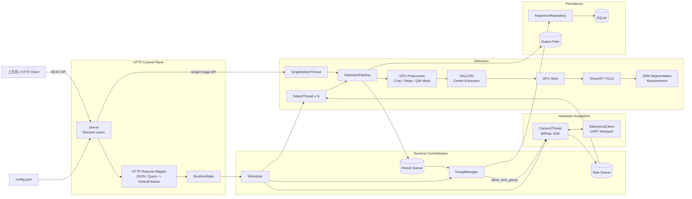
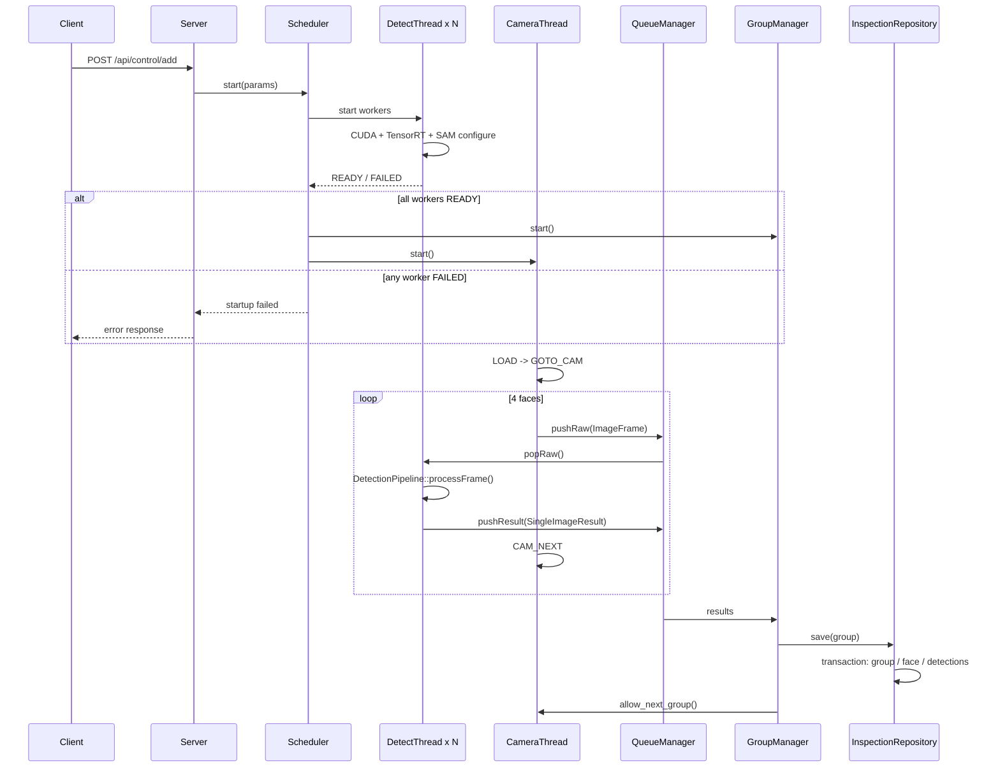

# Cylinder Detection

基于 **C++20 / OpenCV CUDA / TensorRT / HALCON / SAM / SQLite / libevent** 的工业圆柱表面缺陷检测服务。项目面向四面采集场景：滑台完成上料与转面，相机依次采集四个表面，GPU 检测流水线执行预处理、中心定位、切片检测与分割测量，最终按组汇总 GOOD / NG、保存结果并写入 SQLite。

> 当前工程主要面向 Windows + NVIDIA GPU + Visual Studio 2022。相机 SDK、HALCON、TensorRT、OpenCV CUDA 与第三方库需要在本机正确安装和配置。

## 系统架构

当前代码已经按“控制面 / 编排 / 硬件 / 检测流水线 / 聚合 / 持久化”拆分职责。



### 多面检测启动与运行时序

Scheduler 现在先确认所有推理 Worker 已成功完成 CUDA / TensorRT 初始化，最后才启动相机和滑台。模型加载失败不会先移动硬件或采集一批无法处理的图像。



## 模块职责

| 模块 | 负责 | 不负责 |
| --- | --- | --- |
| `main.cpp` | CLI、配置、数据库 bootstrap、run_id、启动 Server | HTTP 路由、算法、相机流程 |
| `Config` | 进程级配置读取、校验、路径归一化 | 请求参数、算法执行 |
| `Server` | HTTP 路由、响应、应用服务触发 | JSON/query 细节转换、检测算法 |
| `Core/http/*` | HTTP 参数读取、`DetectParams` 映射与校验 | Worker / 相机生命周期 |
| `RuntimeState` | 控制面的进程级上下文和当前任务快照 | Worker 的隐式依赖仓库 |
| `Scheduler` | Queue、Worker、GroupManager、Camera 的生命周期编排 | SQL、检测算法 |
| `CameraThread` | 相机 SDK 生命周期、采集、滑台业务时序 | GOOD/NG 判定 |
| `SlideSerialClient` | 串口 transport 与行缓冲 | LOAD/CAM_NEXT 等业务状态机决策 |
| `DetectThread` | 多面 Worker 线程、队列消费、结果发布 | HALCON / YOLO / SAM 具体实现 |
| `SingleDetectThread` | 单图任务队列和同步 | 具体检测算法 |
| `DetectionPipeline` | preprocess -> HALCON -> Slice -> YOLO -> SAM -> DTO | HTTP、线程编排、数据库 |
| `GroupManager` | 四面结果聚合、timeout、完成事件 | SQL 表结构 |
| `InspectionRepository` | group/face/detection 事务持久化 | 线程和硬件控制 |
| `SQLiteHelper` | SQLite connection / prepared statement RAII | 业务表语义 |

更严格的依赖边界见 [`docs/MODULE_RESPONSIBILITIES.md`](docs/MODULE_RESPONSIBILITIES.md)。

## 目录结构

```text
.
├── main.cpp
├── config.json
├── Core/
│   ├── Config.*
│   ├── Server.*
│   ├── Scheduler.*
│   ├── runtime_state.hpp
│   ├── detect_params.hpp
│   ├── detection_context.hpp
│   ├── detection_pipeline.*
│   ├── camera_thread.*
│   ├── slide_serial.*
│   ├── queue_manager.*
│   ├── detect_thread.*
│   ├── single_detect_thread.*
│   ├── group_manager.*
│   ├── inspection_repository.*
│   ├── db_utils.*
│   ├── sqlite_helper.*
│   ├── image_types.hpp
│   ├── http/
│   │   ├── request_params.*
│   │   └── detect_request_mapper.*
│   └── detect/
│       ├── preprocess_options.hpp
│       ├── crop_image.*
│       ├── HalconProcessor.*
│       ├── Slice.*
│       ├── trtyolo_slice.*
│       ├── sam.*
│       ├── speedSam.*
│       ├── engineTRT.*
│       └── StripeRemoval.*
├── docs/
│   ├── CODE_AUDIT.md
│   ├── STATIC_ANALYSIS.md
│   ├── MODULE_RESPONSIBILITIES.md
│   └── ...
├── pytesttool/
├── mt.sln
└── mt.vcxproj
```

## 配置

所有相对路径都以 **配置文件所在目录** 为基准解析，因此运行时配置不需要绑定某台开发机的盘符。

```json
{
  "host": "127.0.0.1",
  "analyzerPort": 9003,
  "modelDir": "./models",
  "uploadDir": "./output",
  "dbPath": "./data/my_inspection.db",
  "gpuDevice": 0,
  "detectThreads": 4,
  "groupTimeoutMs": 55000,
  "slidePort": "",
  "slideAxisId": 0,
  "slideTimeoutMs": 20000
}
```

| 配置 | 作用 |
| --- | --- |
| `host` / `analyzerPort` | HTTP 监听地址与端口 |
| `modelDir` | TensorRT / SAM 模型根目录 |
| `uploadDir` | 图片与可视化结果目录 |
| `dbPath` | SQLite 数据库路径 |
| `gpuDevice` | 目标 CUDA device |
| `detectThreads` | 多面检测 Worker 数 |
| `groupTimeoutMs` | 四面结果聚合超时 |
| `slidePort` | 滑台串口，例如 `COM11`；空表示禁用 |
| `slideAxisId` | 滑台轴 ID |
| `slideTimeoutMs` | 等待滑台响应超时 |

## 模型目录

建议：

```text
models/
├── defect.engine
└── SAM/
    ├── SAM_encoder.engine
    ├── SAM_mask_decoder.engine
    ├── SAM_encoder.onnx
    └── SAM_mask_decoder.onnx
```

HTTP 请求中的相对模型名会以 `modelDir` 为根目录解析。SAM engine 不存在时，流水线会尝试对应 ONNX 路径；SAM 当前作为后处理增强阶段，初始化失败时保留 YOLO 检测结果并记录错误。

## 启动

```powershell
mt.exe -f config.json
```

```powershell
mt.exe --help
```

主要 API：

```text
GET  /api/health
POST /api/control/add
GET  /api/control/cancel
POST /api/single_detect/add
GET  /api/single_detect/cancel
GET  /api/camera/single_capture
GET  /api/camera/status
GET  /api/camera/stop
```

完整参数见 [`docs/api.md`](docs/api.md)。测试工具位于 `pytesttool/`，公共 HTTP/config 逻辑已集中到 `api_common.py`。

## 输出与数据库

程序启动时初始化：

- `inspection_runs`：一次程序运行；
- `inspection_groups`：四面检测组及 GOOD / NG；
- `inspection_faces`：每个面的结果路径；
- `defect_detections`：类别、置信度、bbox、长度、面积。

输出：

```text
output/{run_id}/{group_id}/...
output/{run_id}/single/...
```

`InspectionRepository` 负责 group/face/detection 事务，Scheduler 不再直接编写 SQL。SQLite 每个 connection 启用 foreign keys 和 busy timeout。

## 已完成的工程重构

目前已完成的主要静态重构包括：

- 清理入口中的历史实验代码，统一 CLI；
- 运行时路径配置化并按配置文件目录解析；
- 统一 process-level `run_id`；
- GPU、Worker 数、聚合 timeout 等运行参数配置化；
- HTTP 参数读取和 `DetectParams` 映射从 `Server.cpp` 拆出；
- `DetectThread` 与 `SingleDetectThread` 共用 `DetectionPipeline`；
- Worker 不再从 `RuntimeState` 偷读 output/run_id，而是接收 `DetectionContext`；
- Scheduler 等待所有 Worker READY 后才启动相机硬件；
- 预处理从 20+ 位置参数逐步迁移为 `PreprocessOptions`；
- 失败帧显式生成 `processing_ok=false` 的结果，避免神秘 group timeout；
- 修复 QueueManager 条件变量 lost-wakeup 窗口；
- 持久化拆到 `InspectionRepository`；
- SQLite prepared statement / connection 生命周期加固；
- TensorRT wrapper 在构造失败时清理资源，并按配置 tensor name 映射输入输出；
- SAM decoder 的 `iou_predictions` / `low_res_masks` 不再通过 buffer 大小猜测；
- Visual Studio 的第三方路径改为可覆盖的 MSBuild properties；
- Python API 调试脚本与当前 Server 契约同步。

## 仍需实机 / 模型验证的问题

这些问题没有仅凭静态分析强行改变行为：

1. **相机组采集失败仍可能无限重试当前 face。** 需要在真实设备上确定合理 retry budget 和异常恢复动作。
2. **Queue 仍未设置容量上限。** 推理长期慢于采集时需要明确 backpressure / drop / pause 策略。
3. **单图 HTTP API 仍同步等待 GPU/HALCON。** 长任务会占用 libevent callback，需要进一步改成异步 job 模型。
4. **正在执行的 GPU/HALCON task 无法硬取消。** 当前取消主要针对排队任务和下一次循环。
5. **SAM image encoder 可能针对每个 detection 重复运行。** 可优化为每图 encode 一次，但需要模型回归验证。
6. **SAM 多 mask 输出的最终选择策略需要核对实际 engine。** 当前不擅自改变模型语义。
7. **TensorRT 仍使用 `executeV2` binding array。** 下一阶段可根据部署 TensorRT 版本评估迁移到 name/address based enqueue API。
8. **数据库仍是 schema bootstrap，不是真正 migration。** 下次 schema 变化前应引入 `PRAGMA user_version`。
9. **Debug/Win32 构建配置与 Release x64 依赖配置并不等价。** 当前生产目标仍应明确为 x64。
10. **缺少可脱离真实相机/HALCON/GPU 的自动化测试。** 后续应通过硬件接口和 Pipeline seam 增加 mock/contract tests。

完整静态审计见 [`docs/STATIC_ANALYSIS.md`](docs/STATIC_ANALYSIS.md) 与 [`docs/CODE_AUDIT.md`](docs/CODE_AUDIT.md)。

## 开发原则

- **算法行为与工程重构分离**：阈值、坐标规则、模型输出解释不要和线程/模块重构混在一个验证周期。
- **依赖显式传递**：新模块优先构造参数/上下文，不新增 Service Locator 式全局读取。
- **失败必须可传播**：模型、相机、数据库启动失败必须能到达调用方。
- **线程类只管生命周期**：具体算法集中到 Pipeline，具体 SQL 集中到 Repository。
- **硬件边界可替换**：Camera / Slide 最终应可 mock，便于脱离设备测试。
- **先观测再优化**：下一阶段建议增加阶段耗时、queue 水位、模型初始化时间和每组端到端 latency。

## License

仓库当前未提供明确 License；如计划公开复用或发布二进制，需要同时确认 HALCON、TensorRT、相机 SDK 等商业/第三方依赖的授权约束。
