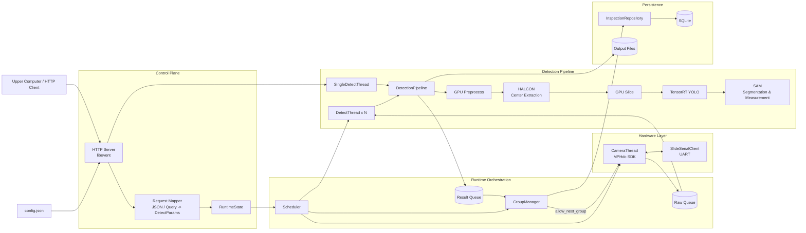
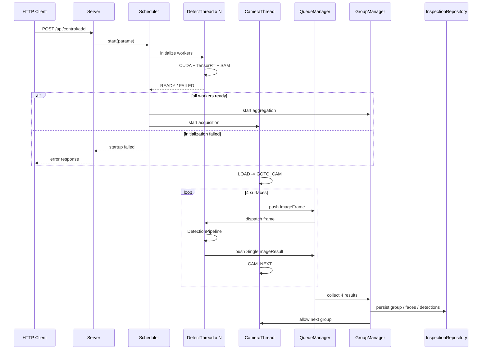

# Cylinder Detection

面向工业圆柱表面检测场景的多面视觉检测服务，基于 **C++20、OpenCV CUDA、TensorRT、HALCON、SAM、SQLite 与 libevent** 构建。

系统通过滑台与工业相机完成圆柱工件的四面自动采集，在 GPU 上执行图像预处理、候选区域定位、切片检测和分割测量，并将四个面的检测结果聚合为完整工件结果，输出缺陷位置、类别、置信度、面积、尺寸以及 GOOD / NG 判定。

> 目标运行环境：Windows x64、NVIDIA GPU、Visual Studio 2022。相机 SDK、HALCON、CUDA / TensorRT、OpenCV CUDA 等依赖需要在部署环境中正确配置。

## 核心能力

- **四面自动检测**：支持滑台上料、定位、转面、四面采集与组级结果聚合。
- **GPU 检测流水线**：基于 OpenCV CUDA、TensorRT 和自定义切片检测实现 GPU 加速处理。
- **多阶段缺陷分析**：组合图像预处理、HALCON 中心区域提取、YOLO 检测与 SAM 分割测量。
- **多 Worker 并行推理**：检测线程数量可配置，采集与推理解耦。
- **单图检测模式**：支持通过 HTTP API 对本地图像执行与在线检测一致的推理流水线。
- **统一结果管理**：保存原图、骨架图、缺陷可视化结果及结构化检测数据。
- **SQLite 持久化**：按运行、工件组、表面和缺陷四个层级保存检测记录。
- **HTTP 控制接口**：提供任务启动、取消、健康检查、单图检测和相机控制接口。
- **可配置部署**：模型目录、输出目录、数据库、GPU、Worker 数量、滑台串口和超时参数均通过配置文件管理。

## 系统架构



## 检测流程

一次完整的四面检测任务按照以下顺序运行：



### 单帧检测流水线

```text
Input Image
    |
    v
GPU Preprocess
  - ROI crop
  - stripe suppression
  - QW mask
  - denoise
    |
    v
HALCON Center Extraction
    |
    v
GPU Slice Extraction
    |
    v
TensorRT YOLO Detection
    |
    v
SAM Segmentation
    |
    v
Geometry Measurement
  - area
  - diameter / length
    |
    v
SingleImageResult
```

## 技术栈

| 组件 | 用途 |
| --- | --- |
| C++20 | 服务主体、并发调度与算法编排 |
| OpenCV CUDA | GPU 图像上传、裁剪、预处理与图像操作 |
| TensorRT | YOLO 与 SAM 推理引擎 |
| HALCON | 候选区域 / 中心区域提取 |
| SAM | 缺陷区域分割与几何测量 |
| libevent | HTTP 服务与接口路由 |
| SQLite | 检测结果持久化 |
| ConcurrentQueue | 原始图像和结果队列 |
| MPHdc SDK | 工业相机控制与图像采集 |
| Serial / UART | 滑台控制与状态通信 |

## 模块划分

| 模块 | 主要职责 |
| --- | --- |
| `main.cpp` | 程序入口、CLI、配置、数据库初始化、run_id |
| `Config` | 加载部署配置与路径解析 |
| `Server` | HTTP 路由、响应和应用服务入口 |
| `Core/http/*` | HTTP 参数解析、检测参数映射和校验 |
| `Scheduler` | 多面检测任务的生命周期编排 |
| `CameraThread` | 相机采集与滑台检测时序 |
| `SlideSerialClient` | 串口通信 |
| `QueueManager` | 原始图像与检测结果的线程安全传递 |
| `DetectThread` | 多面检测 Worker |
| `SingleDetectThread` | 单图检测任务 Worker |
| `DetectionPipeline` | 单帧完整检测流水线 |
| `GroupManager` | 四面检测结果聚合与超时管理 |
| `InspectionRepository` | 检测结果的数据库事务持久化 |
| `Core/detect/*` | 图像预处理、HALCON、切片、YOLO、SAM、TensorRT |

详细的模块边界和依赖规则见 [`docs/MODULE_RESPONSIBILITIES.md`](docs/MODULE_RESPONSIBILITIES.md)。

## 项目结构

```text
.
├── main.cpp
├── config.json
├── Core/
│   ├── Config.*
│   ├── Server.*
│   ├── Scheduler.*
│   ├── runtime_state.hpp
│   ├── detect_params.hpp
│   ├── detection_context.hpp
│   ├── detection_pipeline.*
│   ├── camera_thread.*
│   ├── slide_serial.*
│   ├── queue_manager.*
│   ├── detect_thread.*
│   ├── single_detect_thread.*
│   ├── group_manager.*
│   ├── inspection_repository.*
│   ├── db_utils.*
│   ├── sqlite_helper.*
│   ├── image_types.hpp
│   ├── http/
│   │   ├── request_params.*
│   │   └── detect_request_mapper.*
│   └── detect/
│       ├── preprocess_options.hpp
│       ├── crop_image.*
│       ├── StripeRemoval.*
│       ├── HalconProcessor.*
│       ├── Slice.*
│       ├── trtyolo_slice.*
│       ├── sam.*
│       ├── speedSam.*
│       └── engineTRT.*
├── docs/
│   ├── MODULE_RESPONSIBILITIES.md
│   ├── STATIC_ANALYSIS.md
│   ├── CODE_AUDIT.md
│   └── ...
├── pytesttool/
├── mt.sln
└── mt.vcxproj
```

## 运行环境

推荐环境：

```text
OS              Windows 10 / 11 x64
Compiler        Visual Studio 2022 / MSVC v143
Language        C++20
GPU             NVIDIA CUDA-capable GPU
CUDA            11.8 build customization
Inference       TensorRT
Image           OpenCV CUDA
Vision          HALCON
Database        SQLite3
HTTP            libevent
```

工程中的第三方依赖根目录通过 MSBuild property 配置：

```text
ThirdPartyRoot
TensorRTRoot
```

其中 `TensorRTRoot` 也可以通过环境变量 `TENSORRT_ROOT` 提供。

## 配置

默认配置文件为 `config.json`：

```json
{
  "version": "4.0",
  "host": "127.0.0.1",
  "analyzerPort": 9003,
  "modelDir": "./models",
  "uploadDir": "./output",
  "dbPath": "./data/my_inspection.db",
  "gpuDevice": 0,
  "detectThreads": 4,
  "groupTimeoutMs": 55000,
  "slidePort": "",
  "slideAxisId": 0,
  "slideTimeoutMs": 20000
}
```

所有相对路径均以 **配置文件所在目录** 为基准解析。

| 配置项 | 说明 |
| --- | --- |
| `host` | HTTP 服务监听地址 |
| `analyzerPort` | HTTP 服务端口 |
| `modelDir` | 模型根目录 |
| `uploadDir` | 检测图片及可视化结果目录 |
| `dbPath` | SQLite 数据库路径 |
| `gpuDevice` | CUDA device index |
| `detectThreads` | 多面检测 Worker 数量 |
| `groupTimeoutMs` | 四面结果聚合超时 |
| `slidePort` | 滑台串口，例如 `COM11`；留空可禁用 |
| `slideAxisId` | 滑台轴 ID |
| `slideTimeoutMs` | 滑台通信超时 |

## 模型目录

推荐目录结构：

```text
models/
├── defect.engine
└── SAM/
    ├── SAM_encoder.engine
    ├── SAM_mask_decoder.engine
    ├── SAM_encoder.onnx
    └── SAM_mask_decoder.onnx
```

检测请求中的相对模型路径会基于 `modelDir` 解析。

SAM 优先使用 TensorRT engine；对应 engine 不存在时，可以回退到配置的 ONNX 模型路径进行初始化。

## 启动服务

```powershell
mt.exe -f config.json
```

查看命令行帮助：

```powershell
mt.exe --help
```

服务启动后默认监听：

```text
http://127.0.0.1:9003
```

实际地址由 `host` 和 `analyzerPort` 决定。

## HTTP API

| Method | Endpoint | 功能 |
| --- | --- | --- |
| `GET` | `/api/health` | 服务、Queue 和任务状态 |
| `POST` | `/api/control/add` | 启动多面检测任务 |
| `GET` | `/api/control/cancel` | 停止当前检测任务 |
| `POST` | `/api/single_detect/add` | 执行单图检测 |
| `GET` | `/api/single_detect/cancel` | 停止单图 Worker |
| `GET` | `/api/camera/single_capture` | 相机单次采图 |
| `GET` | `/api/camera/status` | 查询相机状态 |
| `GET` | `/api/camera/stop` | 停止独立相机 Worker |

完整请求参数和示例见 [`docs/api.md`](docs/api.md)。

`pytesttool/` 提供用于接口联调和冒烟测试的 Python 工具。

## 输出目录

检测结果按程序运行和工件组组织：

```text
output/
└── {run_id}/
    ├── {group_id}/
    │   ├── original_*.png
    │   ├── skeleton_*.png
    │   └── detection_*.png
    └── single/
        └── ...
```

实际文件名由具体检测阶段决定。

## 数据模型

SQLite 中主要包含以下业务表：

```text
inspection_runs
    |
    +-- inspection_groups
            |
            +-- inspection_faces
                    |
                    +-- defect_detections
```

### `inspection_runs`

记录一次程序运行及其 `run_id`。

### `inspection_groups`

记录一个完整圆柱工件的四面检测结果及 GOOD / NG 状态。

### `inspection_faces`

记录每一个检测面的原图、骨架图和可视化结果路径。

### `defect_detections`

记录单个缺陷的：

- 类别；
- 置信度；
- bounding box；
- 面积；
- 长度 / 直径等测量值。

数据库写入由 `InspectionRepository` 统一管理，并以事务方式提交组、表面和缺陷记录。

## 并发与启动策略

为避免硬件已经开始采集而推理模型尚未就绪，系统采用推理优先的启动顺序：

```text
QueueManager
    -> DetectThread x N
        -> CUDA / TensorRT / SAM READY
            -> GroupManager
                -> CameraThread / Slide
```

任意检测 Worker 初始化失败时，任务启动失败，不进入正式采集阶段。

采集帧通过 Raw Queue 分发给多个检测 Worker，检测结果通过 Result Queue 交给 `GroupManager` 聚合。

## 设计特点

### 显式检测上下文

输出目录与 `run_id` 通过 `DetectionContext` 注入检测 Worker，算法流水线不依赖 HTTP 层的全局状态。

### 统一检测流水线

多面检测和单图检测共同使用 `DetectionPipeline`：

```text
DetectThread -------+
                    +--> DetectionPipeline
SingleDetectThread -+
```

避免两套检测逻辑长期分叉。

### 分层持久化

```text
Scheduler
    -> GroupManager
        -> InspectionRepository
            -> SQLiteHelper
```

调度层不直接拼接 SQL，数据库机制与业务数据映射保持分离。

### TensorRT Tensor Name Mapping

TensorRT 封装按模型配置的 tensor name 建立输入输出映射，而不是依赖 engine 内部枚举顺序。SAM decoder 的 IoU 与 mask 输出同样按名称识别。

## 文档

| 文档 | 内容 |
| --- | --- |
| [`docs/MODULE_RESPONSIBILITIES.md`](docs/MODULE_RESPONSIBILITIES.md) | 模块职责和依赖边界 |
| [`docs/STATIC_ANALYSIS.md`](docs/STATIC_ANALYSIS.md) | 文件级静态分析记录 |
| [`docs/CODE_AUDIT.md`](docs/CODE_AUDIT.md) | 工程审计与风险记录 |
| [`docs/api.md`](docs/api.md) | HTTP API 参数与示例 |

## License & Third-Party Software

本仓库源码的授权范围见 [`LICENSE`](LICENSE)。除单独声明的文件外，本项目源码默认保留全部权利；公开仓库本身不代表授予复制、修改、再分发、商业使用或再许可的权利。

本项目依赖多个具有独立许可条款的第三方组件。第三方软件、SDK、驱动、模型和二进制文件不属于本项目源码许可的授权范围，使用者应根据实际部署环境自行取得相应授权并遵守其许可协议。

其中 **MVTec HALCON 为商业软件**。构建、开发或部署包含 HALCON 的功能时，需要由使用者向 MVTec 或其授权渠道取得与使用场景相匹配的有效 HALCON 许可证。本仓库不提供 HALCON 软件授权、license 文件、license key，也不转授任何 HALCON 的开发或运行时使用权。

同样，本仓库不会因为源代码公开而自动授予 NVIDIA CUDA / TensorRT、工业相机 SDK、设备驱动或其他第三方组件的再分发与商业使用权。相关组件仍分别受其原始许可协议约束。

本仓库不包含任何商业软件许可证密钥，亦不应提交此类凭据。有关 HALCON 的许可类型、开发许可和运行时许可，请参阅 [MVTec HALCON Licensing](https://www.mvtec.com/products/halcon/editions-licensing/get-a-license)。
