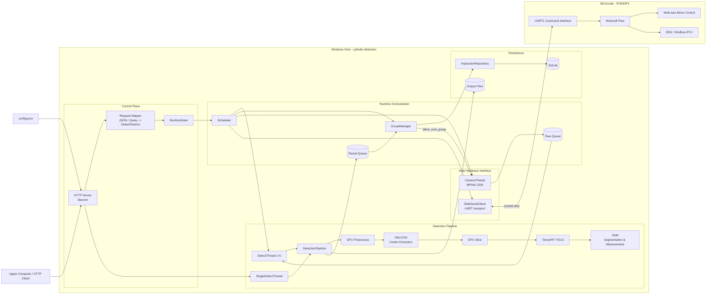
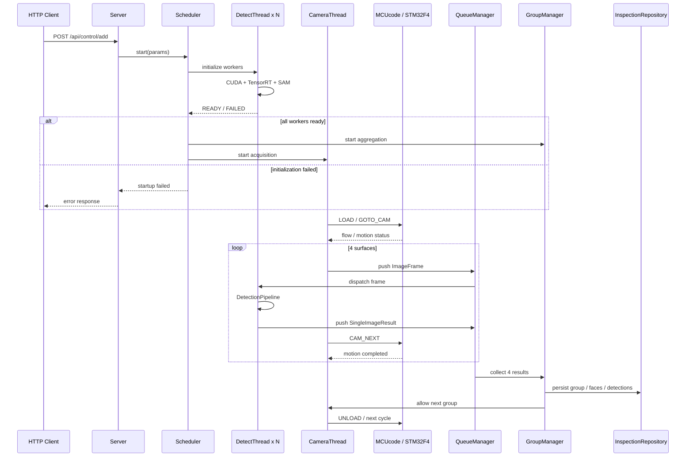

# Cylinder Detection

A multi-surface visual inspection service for industrial cylindrical workpieces, built with **C++20, OpenCV CUDA, TensorRT, HALCON, SAM, SQLite, and libevent**.

The system uses a linear stage and industrial camera to automatically acquire four views of each cylindrical workpiece. GPU processing performs image preprocessing, candidate-region localization, tiled detection, segmentation, and measurement. Results from all four surfaces are aggregated into a complete workpiece result, including defect locations, classes, confidence scores, areas, dimensions, and GOOD / NG decisions.

This repository provides the **Windows host-side vision and inference service** for the inspection equipment. Motion control, calibration, actuator sequencing, and the UART1 device protocol are provided by the companion STM32F4 firmware project **[MCUcode](https://github.com/CoisiniYv/MCUcode)**. Together, the two repositories form a complete industrial inspection system.

> Target environment: Windows x64, NVIDIA GPU, and Visual Studio 2022. Dependencies including the camera SDK, HALCON, CUDA / TensorRT, and OpenCV CUDA must be configured in the deployment environment. Full automation also requires the companion MCUcode firmware.

## Companion Controller: MCUcode

[`MCUcode`](https://github.com/CoisiniYv/MCUcode) provides embedded device control for this project. The two projects have distinct responsibilities:

| Project | Runtime | Main Responsibilities |
| --- | --- | --- |
| **cylinder-detection** | Windows / NVIDIA GPU | HTTP service, industrial-camera acquisition, task scheduling, GPU inference, HALCON / YOLO / SAM, result aggregation, and SQLite persistence |
| **MCUcode** | STM32F4 | Multi-axis motion, calibration, workcell sequencing, actuator control, ERG/Modbus-RTU, and the UART1 host protocol |

The host communicates with the MCU's UART1 through `SlideSerialClient`. The current firmware uses an ASCII command frame:

```text
<id>,<dir>,<steps>,<dly>\r\n
```

The main inspection workflow commands are:

| `dir` | MCU Flow Command | Purpose |
| ---: | --- | --- |
| `20` | `LOAD` | Load the workpiece / enter the workflow |
| `21` | `GOTO_CAM` | Move to the camera inspection position |
| `22` | `UNLOAD` | Unload the workpiece |
| `23` | `CAM_NEXT` | Advance to the next inspection surface |

This repository handles **acquisition, analysis, decisions, and recording**; MCUcode handles **motion, execution, and feedback**.

## Core Capabilities

- **Automatic four-surface inspection**: stage loading, positioning, surface rotation, four-view acquisition, and group-level result aggregation.
- **GPU detection pipeline**: accelerated processing with OpenCV CUDA, TensorRT, and custom tiled detection.
- **Multi-stage defect analysis**: image preprocessing, HALCON center-region extraction, YOLO detection, and SAM segmentation and measurement.
- **Parallel inference workers**: configurable detection thread count with acquisition decoupled from inference.
- **Single-image mode**: HTTP APIs apply the same inference pipeline to local images as online inspection.
- **Unified result management**: original images, skeleton images, defect visualizations, and structured detection data.
- **SQLite persistence**: inspection records organized by run, workpiece group, surface, and defect.
- **HTTP control APIs**: task startup, cancellation, health checks, single-image detection, and camera control.
- **Configurable deployment**: model and output directories, database, GPU, worker count, stage serial port, and timeouts are managed through configuration.
- **Host-device coordination**: UART decouples vision task orchestration from STM32F4 real-time motion control.

## System Architecture


```mermaid
flowchart LR
    Client[Upper Computer / HTTP Client]
    Config[config.json]

    subgraph Host[Windows Host - cylinder-detection]
        subgraph Control[Control Plane]
            Server[HTTP Server\nlibevent]
            Mapper[Request Mapper\nJSON / Query -> DetectParams]
            State[RuntimeState]
        end

        subgraph Runtime[Runtime Orchestration]
            Scheduler[Scheduler]
            RawQ[(Raw Queue)]
            ResultQ[(Result Queue)]
            Group[GroupManager]
        end

        subgraph Hardware[Host Hardware Interface]
            Camera[CameraThread\nMPHdc SDK]
            Slide[SlideSerialClient\nUART transport]
        end

        subgraph Inference[Detection Pipeline]
            Workers[DetectThread x N]
            Single[SingleDetectThread]
            Pipeline[DetectionPipeline]
            Pre[GPU Preprocess]
            Halcon[HALCON\nCenter Extraction]
            Slice[GPU Slice]
            YOLO[TensorRT YOLO]
            SAM[SAM\nSegmentation & Measurement]
        end

        subgraph Storage[Persistence]
            Repo[InspectionRepository]
            DB[(SQLite)]
            Files[(Output Files)]
        end
    end

    subgraph Controller[MCUcode - STM32F4]
        MCUUART[UART1 Command Interface]
        Flow[Workcell Flow]
        Motor[Multi-axis Motor Control]
        ERG[ERG / Modbus-RTU]
    end

    Config --> Server
    Client --> Server
    Server --> Mapper --> State --> Scheduler

    Scheduler --> Workers
    Scheduler --> Group
    Scheduler --> Camera
    Scheduler --> Slide

    Camera --> RawQ --> Workers
    Slide <-->|115200 8N1| MCUUART
    MCUUART --> Flow
    Flow --> Motor
    Flow --> ERG

    Workers --> Pipeline
    Single --> Pipeline
    Pipeline --> Pre --> Halcon --> Slice --> YOLO --> SAM
    Pipeline --> Files
    Pipeline --> ResultQ --> Group

    Group --> Repo --> DB
    Group -->|allow_next_group| Camera

    Server --> Single
```

## Inspection Workflow

A complete four-surface inspection task is coordinated by the host vision service and STM32 controller:


```mermaid
sequenceDiagram
    participant C as HTTP Client
    participant S as Server
    participant SCH as Scheduler
    participant D as DetectThread x N
    participant CAM as CameraThread
    participant MCU as MCUcode / STM32F4
    participant Q as QueueManager
    participant G as GroupManager
    participant DB as InspectionRepository

    C->>S: POST /api/control/add
    S->>SCH: start(params)

    SCH->>D: initialize workers
    D->>D: CUDA + TensorRT + SAM
    D-->>SCH: READY / FAILED

    alt all workers ready
        SCH->>G: start aggregation
        SCH->>CAM: start acquisition
    else initialization failed
        SCH-->>S: startup failed
        S-->>C: error response
    end

    CAM->>MCU: LOAD / GOTO_CAM
    MCU-->>CAM: flow / motion status

    loop 4 surfaces
        CAM->>Q: push ImageFrame
        Q->>D: dispatch frame
        D->>D: DetectionPipeline
        D->>Q: push SingleImageResult
        CAM->>MCU: CAM_NEXT
        MCU-->>CAM: motion completed
    end

    Q->>G: collect 4 results
    G->>DB: persist group / faces / detections
    G->>CAM: allow next group
    CAM->>MCU: UNLOAD / next cycle
```

### Single-Frame Detection Pipeline

```text
Input Image
    |
    v
GPU Preprocess
  - ROI crop
  - stripe suppression
  - QW mask
  - denoise
    |
    v
HALCON Center Extraction
    |
    v
GPU Slice Extraction
    |
    v
TensorRT YOLO Detection
    |
    v
SAM Segmentation
    |
    v
Geometry Measurement
  - area
  - diameter / length
    |
    v
SingleImageResult
```

## Technology Stack

| Component | Purpose |
| --- | --- |
| C++20 | Core service, concurrent scheduling, and algorithm orchestration |
| OpenCV CUDA | GPU image upload, cropping, preprocessing, and image operations |
| TensorRT | YOLO and SAM inference engines |
| HALCON | Candidate-region / center-region extraction |
| SAM | Defect segmentation and geometric measurement |
| libevent | HTTP service and API routing |
| SQLite | Inspection result persistence |
| ConcurrentQueue | Raw-image and result queues |
| MPHdc SDK | Industrial-camera control and image acquisition |
| Serial / UART | Host-to-STM32 controller communication |
| STM32F4 / MCUcode | Multi-axis motion, workcell sequencing, and actuator control |

## Modules

| Module | Main Responsibilities |
| --- | --- |
| `main.cpp` | Entry point, CLI, configuration, database initialization, and run_id |
| `Config` | Deployment configuration loading and path resolution |
| `Server` | HTTP routing, responses, and application service entry points |
| `Core/http/*` | HTTP parameter parsing, detection parameter mapping, and validation |
| `Scheduler` | Multi-surface inspection task lifecycle orchestration |
| `CameraThread` | Camera acquisition and coordination with device motion |
| `SlideSerialClient` | PC-side UART transport to MCUcode UART1 |
| `QueueManager` | Thread-safe transfer of raw images and detection results |
| `DetectThread` | Multi-surface detection worker |
| `SingleDetectThread` | Single-image detection worker |
| `DetectionPipeline` | Complete single-frame detection pipeline |
| `GroupManager` | Four-surface result aggregation and timeout management |
| `InspectionRepository` | Transactional database persistence of inspection results |
| `Core/detect/*` | Preprocessing, HALCON, tiling, YOLO, SAM, and TensorRT |
| [`MCUcode`](https://github.com/CoisiniYv/MCUcode) | STM32F4 multi-axis motion, calibration, workcell sequencing, ERG/Modbus, and UART1 protocol |

See [`docs/MODULE_RESPONSIBILITIES.md`](docs/MODULE_RESPONSIBILITIES.md) for detailed module boundaries and dependency rules.

## Repository Structure

```text
.
├── main.cpp
├── config.json
├── Core/
│   ├── Config.*
│   ├── Server.*
│   ├── Scheduler.*
│   ├── runtime_state.hpp
│   ├── detect_params.hpp
│   ├── detection_context.hpp
│   ├── detection_pipeline.*
│   ├── camera_thread.*
│   ├── slide_serial.*
│   ├── queue_manager.*
│   ├── detect_thread.*
│   ├── single_detect_thread.*
│   ├── group_manager.*
│   ├── inspection_repository.*
│   ├── db_utils.*
│   ├── sqlite_helper.*
│   ├── image_types.hpp
│   ├── http/
│   │   ├── request_params.*
│   │   └── detect_request_mapper.*
│   └── detect/
│       ├── preprocess_options.hpp
│       ├── crop_image.*
│       ├── StripeRemoval.*
│       ├── HalconProcessor.*
│       ├── Slice.*
│       ├── trtyolo_slice.*
│       ├── sam.*
│       ├── speedSam.*
│       └── engineTRT.*
├── docs/
│   ├── MODULE_RESPONSIBILITIES.md
│   ├── STATIC_ANALYSIS.md
│   ├── CODE_AUDIT.md
│   └── ...
├── pytesttool/
├── mt.sln
└── mt.vcxproj
```

The companion embedded firmware is maintained in the separate [`CoisiniYv/MCUcode`](https://github.com/CoisiniYv/MCUcode) repository. It is not included as a Git submodule, allowing the host and firmware to be built, released, and versioned independently.

## Runtime Environment

Recommended environment:

```text
OS              Windows 10 / 11 x64
Compiler        Visual Studio 2022 / MSVC v143
Language        C++20
GPU             NVIDIA CUDA-capable GPU
CUDA            11.8 build customization
Inference       TensorRT
Image           OpenCV CUDA
Vision          HALCON
Database        SQLite3
HTTP            libevent
Controller      STM32F4 running MCUcode (full automatic system)
Host-MCU Link   UART 115200 8N1
```

Third-party dependency roots are configured through MSBuild properties:

```text
ThirdPartyRoot
TensorRTRoot
```

`TensorRTRoot` can also be supplied through the `TENSORRT_ROOT` environment variable.

## Configuration

The default configuration file is `config.json`:

```json
{
  "version": "4.0",
  "host": "127.0.0.1",
  "analyzerPort": 9003,
  "modelDir": "./models",
  "uploadDir": "./output",
  "dbPath": "./data/my_inspection.db",
  "gpuDevice": 0,
  "detectThreads": 4,
  "groupTimeoutMs": 55000,
  "slidePort": "",
  "slideAxisId": 0,
  "slideTimeoutMs": 20000
}
```

All relative paths are resolved against **the directory containing the configuration file**.

| Option | Description |
| --- | --- |
| `host` | HTTP bind address |
| `analyzerPort` | HTTP port |
| `modelDir` | Model root directory |
| `uploadDir` | Inspection image and visualization output directory |
| `dbPath` | SQLite database path |
| `gpuDevice` | CUDA device index |
| `detectThreads` | Number of multi-surface detection workers |
| `groupTimeoutMs` | Timeout for aggregating four-surface results |
| `slidePort` | Serial port connected to the MCUcode controller, e.g. `COM11`; leave empty to disable |
| `slideAxisId` | Linear-stage axis ID |
| `slideTimeoutMs` | Host timeout for MCU flow / motion responses |

## Model Directory

Recommended layout:

```text
models/
├── defect.engine
└── SAM/
    ├── SAM_encoder.engine
    ├── SAM_mask_decoder.engine
    ├── SAM_encoder.onnx
    └── SAM_mask_decoder.onnx
```

Relative model paths in detection requests are resolved against `modelDir`.

SAM prefers TensorRT engines. If the corresponding engine is unavailable, initialization can fall back to the configured ONNX model path.

## Start the Service

```powershell
mt.exe -f config.json
```

Display command-line help:

```powershell
mt.exe --help
```

The service listens at the following address by default:

```text
http://127.0.0.1:9003
```

The actual address is determined by `host` and `analyzerPort`.

Full automatic inspection also requires:

1. Integrate and flash the [`MCUcode`](https://github.com/CoisiniYv/MCUcode) firmware onto the target STM32F4 controller.
2. Connect the Windows host and controller through UART.
3. Set the corresponding serial port in the `slidePort` field of `config.json`.
4. Calibrate motion, camera positions, and workcell sequencing before starting automatic inspection.

The MCU controller does not need to be online when using only the single-image detection API.

## HTTP API

| Method | Endpoint | Function |
| --- | --- | --- |
| `GET` | `/api/health` | Service, queue, and task status |
| `POST` | `/api/control/add` | Start a multi-surface inspection task |
| `GET` | `/api/control/cancel` | Stop the current inspection task |
| `POST` | `/api/single_detect/add` | Run single-image detection |
| `GET` | `/api/single_detect/cancel` | Stop the single-image worker |
| `GET` | `/api/camera/single_capture` | Capture a single camera image |
| `GET` | `/api/camera/status` | Query camera status |
| `GET` | `/api/camera/stop` | Stop the standalone camera worker |

See [`docs/api.md`](docs/api.md) for complete request parameters and examples.

`pytesttool/` provides Python utilities for API integration and smoke testing.

## Output Directory

Inspection results are organized by application run and workpiece group:

```text
output/
└── {run_id}/
    ├── {group_id}/
    │   ├── original_*.png
    │   ├── skeleton_*.png
    │   └── detection_*.png
    └── single/
        └── ...
```

Actual filenames depend on the detection stage.

## Data Model

SQLite contains the following main tables:

```text
inspection_runs
    |
    +-- inspection_groups
            |
            +-- inspection_faces
                    |
                    +-- defect_detections
```

### `inspection_runs`

Records an application run and its `run_id`.

### `inspection_groups`

Records four-surface inspection results and GOOD / NG status for a complete cylindrical workpiece.

### `inspection_faces`

Records the original, skeleton, and visualization image paths for each inspected surface.

### `defect_detections`

Records the following attributes for each defect:

- Class;
- Confidence;
- bounding box；
- Area;
- Measurements such as length / diameter.

`InspectionRepository` manages database writes centrally and commits group, surface, and defect records transactionally.

## Concurrency and Startup Strategy

The system initializes inference before acquisition so hardware does not start collecting images before the models are ready:

```text
QueueManager
    -> DetectThread x N
        -> CUDA / TensorRT / SAM READY
            -> GroupManager
                -> CameraThread
                    -> SlideSerialClient
                        -> MCUcode / STM32F4
```

If any detection worker fails to initialize, task startup fails. Acquisition does not begin, and MCU motion is not triggered prematurely.

Captured frames are distributed to detection workers through the Raw Queue. Results pass through the Result Queue to `GroupManager` for aggregation. The host requests device motion and workcell transitions from MCUcode over UART.

## Design Features

### Decoupled Host Processing and Real-Time Control

The Windows service handles compute-intensive vision algorithms and workflow orchestration, while the STM32F4 handles time-sensitive motion and device control. An explicit UART protocol allows vision and embedded control to be developed, tested, and upgraded independently.

### Explicit Detection Context

The output directory and `run_id` are injected into detection workers through `DetectionContext`. The algorithm pipeline does not depend on HTTP-layer global state.

### Shared Detection Pipeline

Multi-surface and single-image detection share `DetectionPipeline`:

```text
DetectThread -------+
                    +--> DetectionPipeline
SingleDetectThread -+
```

This keeps the two detection paths from diverging over time.

### Layered Persistence

```text
Scheduler
    -> GroupManager
        -> InspectionRepository
            -> SQLiteHelper
```

The scheduling layer does not construct SQL directly. Database mechanisms remain separate from application data mapping.

### TensorRT Tensor Name Mapping

The TensorRT wrapper maps inputs and outputs using configured tensor names rather than engine enumeration order. SAM decoder IoU and mask outputs are also identified by name.

## Documentation

| Document | Contents |
| --- | --- |
| [`docs/MODULE_RESPONSIBILITIES.md`](docs/MODULE_RESPONSIBILITIES.md) | Module responsibilities and dependency boundaries |
| [`docs/STATIC_ANALYSIS.md`](docs/STATIC_ANALYSIS.md) | File-level static analysis records |
| [`docs/CODE_AUDIT.md`](docs/CODE_AUDIT.md) | Engineering audit and risk records |
| [`docs/api.md`](docs/api.md) | HTTP API parameters and examples |
| [`MCUcode`](https://github.com/CoisiniYv/MCUcode) | Companion STM32F4 firmware, UART1 protocol, motion control, and device workflows |

See [`MCUcode/docs/uart1_firmware_alignment.md`](https://github.com/CoisiniYv/MCUcode/blob/master/docs/uart1_firmware_alignment.md) for the MCU-side UART protocol and firmware behavior.

## License & Third-Party Software

The licensing scope of this repository's source code is defined in [`LICENSE`](LICENSE). Unless a file states otherwise, all rights are reserved. Public availability of the repository does not grant rights to copy, modify, redistribute, use commercially, or sublicense the source code.

This project depends on third-party components with independent license terms. Third-party software, SDKs, drivers, models, and binaries are outside the scope of this project's source-code license. Users must obtain the appropriate authorizations for their deployment environment and comply with the respective license agreements.

**MVTec HALCON is commercial software**. Building, developing, or deploying HALCON-based features requires a valid HALCON license appropriate to the intended use, obtained from MVTec or an authorized channel. This repository does not provide HALCON licenses, license files, or license keys, and does not grant HALCON development or runtime rights.

Publishing this source code also does not grant redistribution or commercial-use rights for NVIDIA CUDA / TensorRT, industrial-camera SDKs, device drivers, or other third-party components. Each remains subject to its original license agreement.

This repository contains no commercial software license keys, and such credentials must not be committed. For HALCON license types, development licenses, and runtime licenses, see [MVTec HALCON Licensing](https://www.mvtec.com/products/halcon/editions-licensing/get-a-license).